# Vinter - Android Shopping & Wishlist App

## Overview

Vinter is a modern Android e-commerce application designed to provide users with a seamless shopping experience. The app allows users to browse products, add items to their wishlist or cart, view product details, and manage their profiles. It leverages **local storage** and **cloud services** for efficient data management and offers smooth, intuitive UI using **Material Design components**.

The app integrates with **Firebase** for real-time authentication and database management, and **Cloudinary** for efficient cloud-based image storage and delivery.

---

## Features

### User Features

- Browse products by categories.
- Add products to **Wishlist** and **Cart**.
- View product details with images loaded from Cloudinary.
- Seamless **search functionality** for products.
- Notifications for updates or offers.
- Persistent user data with **SharedPreferences** and **SQLite/Room**.
- User profile management including preferences and settings.

### Admin/Backend Features

- Products, banners, and images stored in **Cloudinary**.
- User wishlist and cart synced with **Firebase Firestore**.
- Efficient offline storage using **SQLite/Room** for faster access.
- Smooth data loading with **Glide/Picasso** image caching.

---

## Technology Stack

### Programming Languages

- Java (Primary)
- XML (UI Layouts)

### Frameworks

- Material Design Components

### Libraries

- RecyclerView
- ViewPager2
- ConstraintLayout
- Glide / Picasso (Image Loading)
- Firebase Firestore (Cloud Database)

### Storage

- SharedPreferences (Lightweight user data)
- SQLite / Room (Local persistent storage for wishlist and cart)
- Firebase Firestore (Cloud storage for syncing data across devices)
- Cloudinary (Cloud-based media hosting for product images and banners)

---

## App Architecture

Vinter follows **MVVM (Model-View-ViewModel)** architecture for maintainability, modularity, and testability.

**Layers:**

1. **UI Layer:** Activities, Fragments, and RecyclerView adapters.
2. **ViewModel Layer:** Handles UI-related data and communicates with repository.
3. **Repository Layer:** Abstracts data operations from Firebase, Cloudinary, and local storage.
4. **Data Layer:** Firestore, Cloudinary, SQLite/Room, SharedPreferences.

---

## Installation

1. **Clone the repository:**

```bash
git clone https://github.com/abdullahkhu1965/vinter.git
```

2. **Open the project in Android Studio.**
3. **Add Firebase configuration:**
   - Download `google-services.json` from Firebase Console.
   - Place it in the `app/` directory.
4. **Configure Cloudinary:**
   - Add your Cloudinary credentials in `Constants.kt` or `strings.xml`.
5. **Build & Run** the app on an Android device or emulator (Android 8.0+ recommended).

---

## Screenshots

### Splash & Authentication

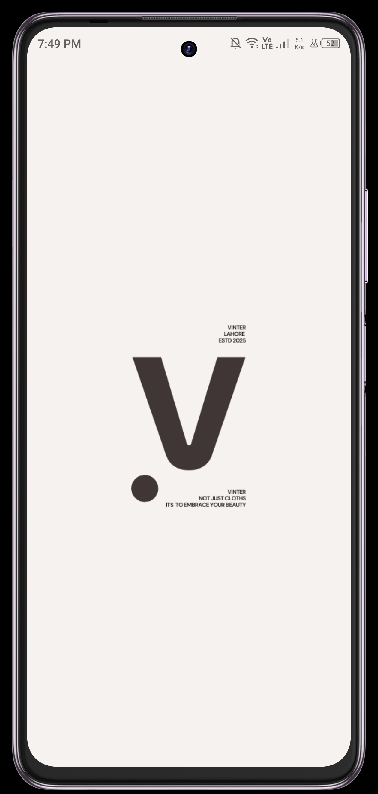
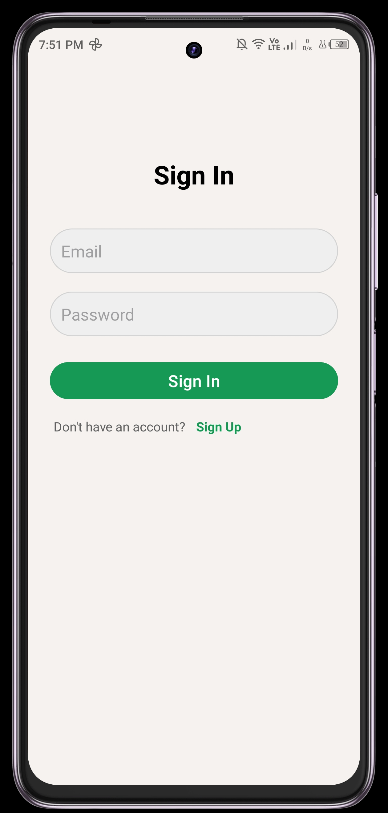
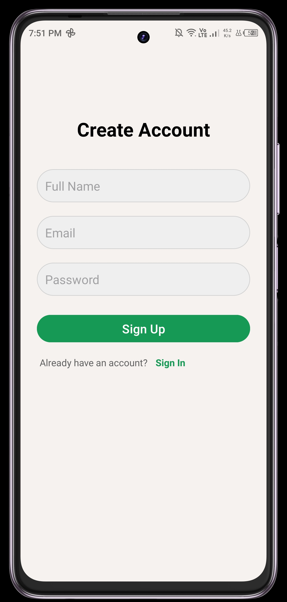

### Home & Products

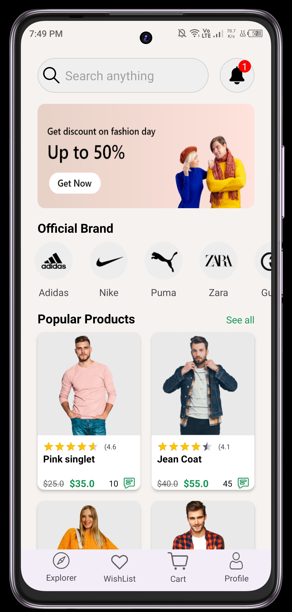
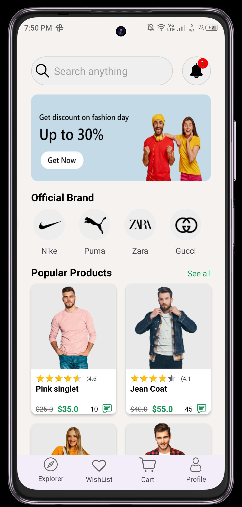
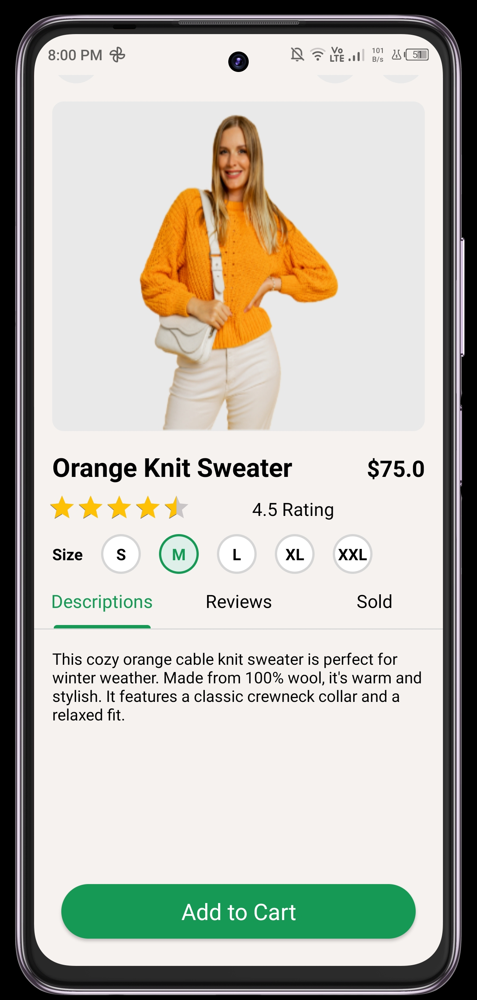
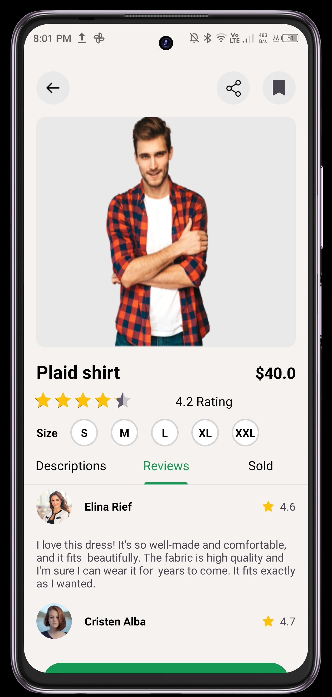

### Wishlist, Cart & Profile

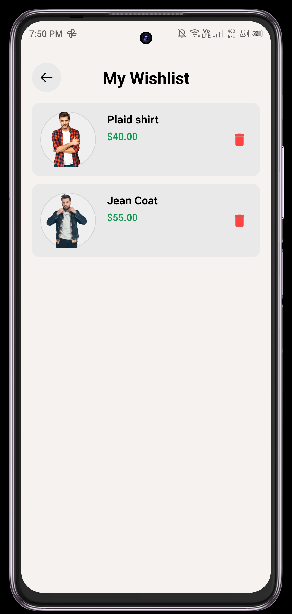
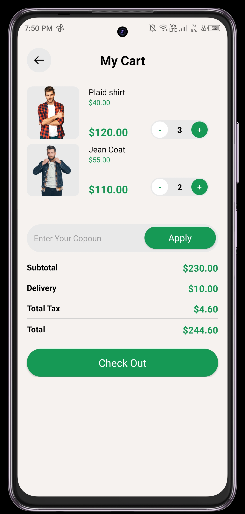
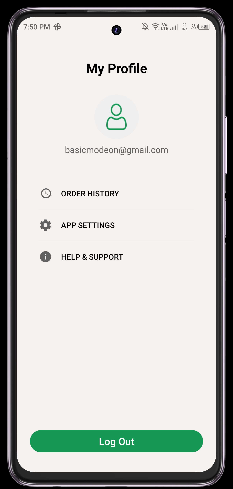

---

## UML Diagrams

### Use Case Diagram

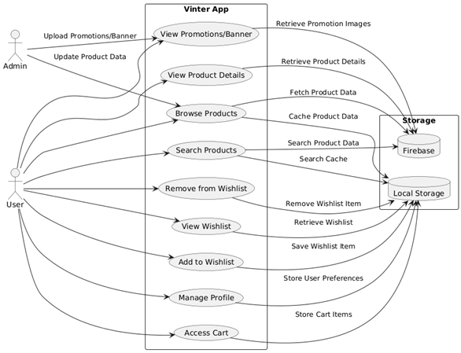

### Class Diagram

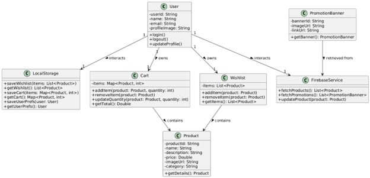

### Activity Diagram

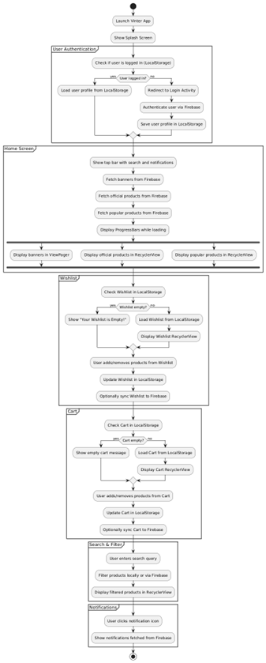

### Sequence Diagram

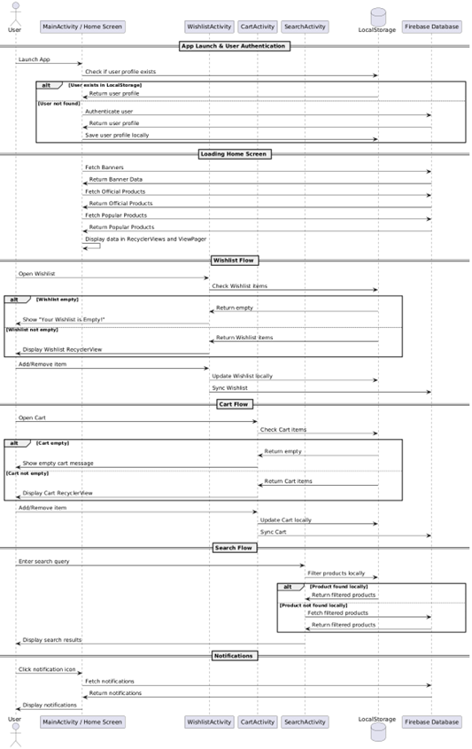

### Deployment Diagram

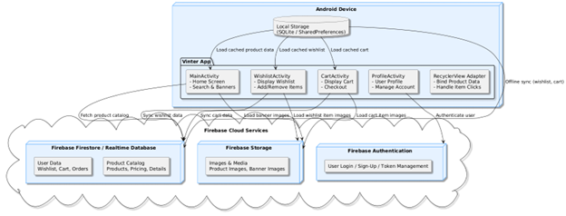

---

## Usage

### Browse Products

- Scroll through categories or use search bar to find products.
- Tap on a product to view detailed information and images.

### Add to Wishlist

- Tap the **heart icon** to add a product to your wishlist.
- Wishlist data is saved locally (SQLite/Room) and synced with Firebase.

### Add to Cart

- Tap the **cart icon** to add items.
- Quantity can be adjusted in the cart screen.

### Notifications

- App shows notifications for promotions, offers, or updates using Firebase.

---

## Testing

The app has been tested on:

- Android 8.0 to Android 14.
- Functional tests for wishlist, cart, and product browsing.
- UI tests for RecyclerView scrolling and banner slider.
- Offline tests using local storage and Firestore sync.

---

## Future Enhancements

- Implement user authentication for personalized accounts.
- Add payment gateway for in-app purchases.
- AI-based product recommendations.
- Dark mode support.
- Analytics integration for user behavior tracking.

---

## Contributing

1. Fork the repository.
2. Create a new branch: `git checkout -b feature/YourFeature`.
3. Commit your changes: `git commit -m 'Add new feature'`.
4. Push to the branch: `git push origin feature/YourFeature`.
5. Submit a pull request.

---

## License

MIT License © 2025 Muhammad Abdullah  
_All rights reserved._

---

## Contact

**Developer:** Muhammad Abdullah  
**Email:** [khurshidabdullah9@gmail.com](mailto:khurshidabdullah9@gmail.com)  
**University:** Lahore Garrison University, Lahore  
**Project Supervisor:** Sir Bilal Butt  
**GitHub Repository:** [https://github.com/abdullahkhu1965/vinter.git](https://github.com/abdullahkhu1965/vinter.git)

---

## Documentation & Proposal

All project documentation including **proposal** and **detailed report** is available in the [`docs/`](docs) folder of the repository.
